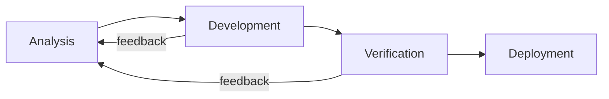

# System Lifecycle

## Status

Normative — Workspace level

## Purpose

This section defines the **end-to-end lifecycle model** used across all NODAL projects.

It describes **how work flows**, how decisions are matured, and how safety, quality, and traceability are enforced from idea to deployment.

This lifecycle is inspired by:

* automotive V-model practices
* safety-oriented development standards
* modular, multi-repository engineering

It is intentionally **process-focused**, not implementation-specific.

---

## Scope

The lifecycle applies to:

* the workspace repository
* all `nodal-*` software modules
* hardware repositories
* tooling that impacts development or validation

Out of scope:

* detailed project planning (handled in GitHub Projects)
* module-internal workflows (may extend this lifecycle)

---

## Lifecycle Overview

The NODAL lifecycle is structured into the following phases:

1. **Analysis**
2. **Development**
3. **Verification**
4. **Deployment**

These phases are:

* sequential at system level
* iterative at module level
* continuously traceable

---

## Core Principles

### Lifecycle Is a System Contract

The lifecycle defines **what is expected at each phase**:

* required inputs
* produced artifacts
* decision gates
* validation criteria

Skipping or weakening a phase is not permitted for safety-relevant work.

---

### Iterative but Controlled

Iteration is allowed and expected, but:

* must be explicit
* must preserve traceability
* must not invalidate safety arguments

All iterations shall be visible through issues, ADRs, and project state.

---

### Traceability by Construction

Every phase contributes to traceability:

| Phase        | Produces                           |
| ------------ | ---------------------------------- |
| Analysis     | Requirements, hazards, assumptions |
| Development  | Code, design, interfaces           |
| Verification | Evidence, test results             |
| Deployment   | Releases, configurations           |

Traceability is not added later — it is built continuously.

---

## Relation to GitHub Projects

The lifecycle phases are mapped to **project fields and views**:

* lifecycle state
* type (feature, hazard, decision, evidence)
* module ownership

GitHub Projects act as the **execution layer** of this lifecycle.

---

## Relation to Architecture

The lifecycle enforces:

* architectural assumptions
* interface stability
* timing and safety constraints

Architecture documents define **what must be respected**.
The lifecycle defines **how compliance is achieved**.

---

## Relation to Safety Case

The safety case relies on lifecycle rigor:

* hazards originate in Analysis
* mitigations are implemented in Development
* claims are supported in Verification
* acceptance is formalized at Deployment

No safety claim is valid without lifecycle evidence.

---

## Governance Alignment

Lifecycle execution is governed by:

* decision rules (ADR)
* contribution model
* release policy

These are defined in `docs/governance/`.

---

## Phase Documents

* [`analysis.md`](analysis.md)
* [`development.md`](development.md)
* [`verification.md`](verification.md)
* [`deployment.md`](deployment.md)

Each phase document specifies:

* objectives
* required artifacts
* exit criteria

---

## Summary

The NODAL lifecycle provides:

* clarity
* discipline
* auditability

It enables independent teams to build **composable, safe, and industrial-grade systems** without losing global coherence.
